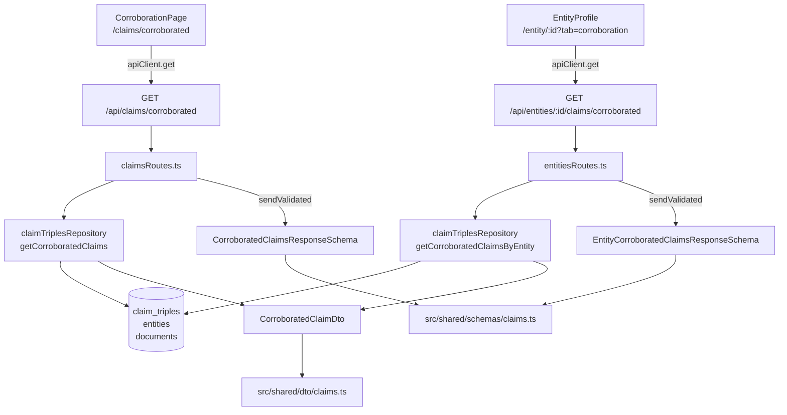
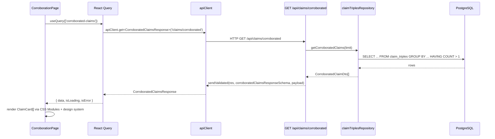
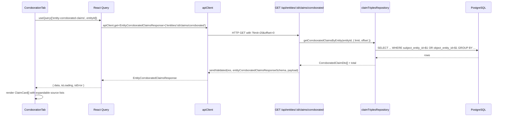

# Design Document: Corroboration Surface Fix

## Overview

This fix addresses four concrete defects in the Corroboration surface introduced during Wave 1 development. The page (`/claims/corroborated`) was hand-rolled rather than following the project's design system contract, leaving it with raw inline styles, a direct `fetch()` call bypassing the `apiClient` layer, locally-duplicated DTO types, and a missing per-entity Corroboration tab that the original Wave 1 spec required. This work brings the surface into full compliance with the architecture conventions observed throughout the rest of the codebase.

The changes are self-contained: no new database tables, no new ingestion pipelines, and no breaking changes to existing API contracts. The backend gains one new repository method and one new route. The frontend gains one shared DTO/schema pair, a refactored page, and a new entity-profile tab component.

---

## Architecture



---

## Sequence Diagrams

### Global Corroboration Page Load



### Per-Entity Corroboration Tab Load



---

## Components and Interfaces

### 1. `src/shared/dto/claims.ts` — New file

**Purpose**: Canonical shared DTO for a corroborated claim. Replaces the duplicate local interfaces in `CorroborationPage.tsx`.

```typescript
export interface CorroboratedClaimDto {
  subjectId: string;
  subjectName: string;
  predicate: string;
  objectId: string | null;
  objectName: string | null;
  objectText: string | null;
  corroborationCount: number;
  documents: Array<{ id: string; title: string }>;
}

export interface CorroboratedClaimsResponse {
  corroborated: CorroboratedClaimDto[];
}

export interface EntityCorroboratedClaimsResponse {
  corroborated: CorroboratedClaimDto[];
  total: number;
  limit: number;
  offset: number;
}
```

**Responsibilities**:

- Single source of truth for the corroboration claim shape
- Used in both the API route response and the frontend query hooks
- Consumed by both `CorroborationPage` and `CorroborationTab`

---

### 2. `src/shared/schemas/claims.ts` — New file

**Purpose**: Zod schemas for validating the two corroboration API responses. Follows the pattern in `src/shared/schemas/entityTabs.ts`.

```typescript
import { z } from 'zod';

export const corroboratedClaimDtoSchema = z.object({
  subjectId: z.string(),
  subjectName: z.string(),
  predicate: z.string(),
  objectId: z.string().nullable(),
  objectName: z.string().nullable(),
  objectText: z.string().nullable(),
  corroborationCount: z.number().int().positive(),
  documents: z.array(z.object({ id: z.string(), title: z.string() })),
});

export const corroboratedClaimsResponseSchema = z.object({
  corroborated: z.array(corroboratedClaimDtoSchema),
});

export const entityCorroboratedClaimsResponseSchema = z.object({
  corroborated: z.array(corroboratedClaimDtoSchema),
  total: z.number().int().nonnegative(),
  limit: z.number().int().positive(),
  offset: z.number().int().nonnegative(),
});
```

---

### 3. `claimTriplesRepository` — New method: `getCorroboratedClaimsByEntity`

**Purpose**: Entity-scoped variant of the existing `getCorroboratedClaims` method. Added to the existing `src/server/db/claimTriplesRepository.ts`.

**Interface**:

```typescript
async getCorroboratedClaimsByEntity(
  entityId: string | number,
  options: { limit?: number; offset?: number }
): Promise<{ rows: CorroboratedClaimDto[]; total: number }>
```

**SQL query** (mirrors the Wave 1 spec's exact prescription):

```sql
SELECT
  ct.subject_entity_id::text  AS "subjectId",
  s.full_name                  AS "subjectName",
  ct.predicate,
  ct.object_entity_id::text   AS "objectId",
  o.full_name                  AS "objectName",
  ct.object_text               AS "objectText",
  COUNT(DISTINCT ct.document_id)::int AS "corroborationCount",
  json_agg(
    DISTINCT jsonb_build_object('id', d.id::text, 'title', COALESCE(d.title, ''))
  ) AS documents
FROM claim_triples ct
JOIN  entities s ON ct.subject_entity_id = s.id
LEFT JOIN entities o ON ct.object_entity_id = o.id
LEFT JOIN documents d ON ct.document_id = d.id
WHERE ct.subject_entity_id = $1 OR ct.object_entity_id = $1
GROUP BY
  ct.subject_entity_id, s.full_name,
  ct.predicate,
  ct.object_entity_id, o.full_name,
  ct.object_text
ORDER BY "corroborationCount" DESC
LIMIT  $2 OFFSET $3
```

Count query for total (runs in parallel):

```sql
SELECT COUNT(DISTINCT (ct.subject_entity_id, ct.predicate, ct.object_entity_id, ct.object_text))
FROM claim_triples ct
WHERE ct.subject_entity_id = $1 OR ct.object_entity_id = $1
HAVING COUNT(DISTINCT ct.document_id) > 1 -- mirrors HAVING filter above
```

Note: the existing `getCorroboratedClaims` global method will also be updated to return `CorroboratedClaimDto[]` matching the new shared type (currently returns an inline anonymous type).

---

### 4. `entitiesRoutes.ts` — New route handler

**Purpose**: Expose `GET /api/entities/:id/claims/corroborated` within the existing entity router. Added to `src/server/routes/entitiesRoutes.ts`.

**Interface**:

```typescript
// Schema for query params
const entityCorroboratedQuerySchema = z.object({
  params: z.object({ id: z.string().min(1) }),
  query: z.object({
    limit:  z.coerce.number().int().min(1).max(100).default(20),
    offset: z.coerce.number().int().min(0).default(0),
  }),
});

router.get(
  '/:id/claims/corroborated',
  validate(entityCorroboratedQuerySchema),
  async (req, res, next) => { ... }
);
```

**Responsibilities**:

- Delegates entirely to `claimTriplesRepository.getCorroboratedClaimsByEntity`
- Calls `sendValidated(res, entityCorroboratedClaimsResponseSchema, payload)` for response
- Returns 404 if the entity ID does not exist (checked via `entitiesRepository.getEntityById`)

---

### 5. `claimsRoutes.ts` — Patch existing route

**Purpose**: Add `sendValidated` validation to the existing `GET /api/claims/corroborated` handler (currently unvalidated raw `res.json`).

**Change**: Replace the existing `res.json({ corroborated })` with `sendValidated(res, corroboratedClaimsResponseSchema, { corroborated })`.

---

### 6. `CorroborationPage.tsx` — Refactored

**Purpose**: Eliminates all inline styles. Replaces direct `fetch()` with `apiClient`. Removes local duplicate interfaces.

**Key structural changes**:

| Before                                                   | After                                                                                        |
| -------------------------------------------------------- | -------------------------------------------------------------------------------------------- |
| `fetch('/api/claims/corroborated')`                      | `apiClient.get<CorroboratedClaimsResponse>('/claims/corroborated')`                          |
| Local `CorroboratedClaim` interface                      | `import type { CorroboratedClaimDto, CorroboratedClaimsResponse } from '@shared/dto/claims'` |
| `style={{ ... }}` on every element                       | CSS Module class names from `CorroborationPage.module.css`                                   |
| Raw `<span>` for badges                                  | `<Badge>` from design system                                                                 |
| Raw `<div>` for loading/error/empty                      | `<EmptyState>` from design system                                                            |
| Raw hover handlers on doc links                          | CSS Module `:hover` rule                                                                     |
| `style={{ display: 'flex', gap: ... }}` on document list | `<Stack>`                                                                                    |

---

### 7. `CorroborationPage.module.css` — New file

**Purpose**: All layout, spacing, and presentational rules for `CorroborationPage`. No inline styles remain in the component. Follows the patterns established in `ConnectionDossierPage.module.css`.

**Responsibilities**:

- Page-level max-width and padding (`--space-*`)
- Claim card layout (using CSS grid/flex via tokens)
- SPO badge row layout
- Corroboration strength badge coloring (maps count ranges to CSS custom property values)
- Document link hover state (`:hover`, `border-color: var(--glass-border)`)
- `@media` breakpoints for mobile wrapping

---

### 8. `CorroborationTab.tsx` — New component

**Purpose**: Per-entity corroboration tab, shown inside entity profile when `?tab=corroboration` is active. Lives at `src/client/components/entities/CorroborationTab.tsx`.

**Interface**:

```typescript
interface CorroborationTabProps {
  entityId: string;
  entityName: string;
}
```

**Responsibilities**:

- Fetches `GET /api/entities/:id/claims/corroborated?limit=20&offset=0` via `apiClient`
- Renders claim cards with expandable document source lists (reuses the same `ClaimCard` sub-component pattern)
- Implements "load more" pagination (offset-based, not page-based) matching the `EntityEvidencePanel` pattern
- Corroboration strength coloring: 1 doc = `--text-muted`, 2–3 docs = amber via `--status-warning`, 4+ docs = `--status-success`
- Empty state via `<EmptyState>` component
- Loading state via `<Skeleton>` component

---

### 9. `CorroborationTab.module.css` — New file

**Purpose**: Styles for `CorroborationTab`. Shares the same token vocabulary as `CorroborationPage.module.css` — both can import a shared `ClaimCard` pattern or duplicate the minimal ruleset.

---

## Data Models

### `CorroboratedClaimDto`

```typescript
interface CorroboratedClaimDto {
  subjectId: string; // entity UUID
  subjectName: string; // entity full_name
  predicate: string; // e.g. "traveled with", "employed by"
  objectId: string | null; // entity UUID if object is a known entity
  objectName: string | null; // entity full_name if objectId is set
  objectText: string | null; // free text if no entity link
  corroborationCount: number; // DISTINCT document_id count — always ≥ 2
  documents: Array<{
    id: string; // document UUID
    title: string; // document title (COALESCE with empty string)
  }>;
}
```

**Validation rules**:

- `corroborationCount` must be a positive integer ≥ 2 (enforced by SQL `HAVING COUNT > 1` + Zod `z.number().int().positive()`)
- Either `objectName` or `objectText` must be non-null (enforced by business logic, not schema)
- `documents` array must be non-empty if `corroborationCount > 0`

### `CorroboratedClaimsResponse`

```typescript
interface CorroboratedClaimsResponse {
  corroborated: CorroboratedClaimDto[];
}
```

### `EntityCorroboratedClaimsResponse`

```typescript
interface EntityCorroboratedClaimsResponse {
  corroborated: CorroboratedClaimDto[];
  total: number; // total distinct claim groups for this entity (for pagination)
  limit: number; // echo of request limit
  offset: number; // echo of request offset
}
```

---

## Corroboration Strength Thresholds

The strength coloring drives both `CorroborationPage` and `CorroborationTab` badge presentation:

| Count | Label                 | CSS token                  |
| ----- | --------------------- | -------------------------- |
| 2–3   | Corroborated          | `--status-warning` (amber) |
| 4–9   | Strongly corroborated | `--status-success` (green) |
| 10+   | Highly corroborated   | `--accent` (blue/teal)     |

A helper `getCorroborationStrength(count: number): 'moderate' | 'strong' | 'high'` will live in a small utility file or inline within the component — whichever is cleaner given the codebase.

---

## Error Handling

### Loading / error / empty states

All three states use design system components — no raw `<div style={...}>`:

| State   | Component                               | Notes                                             |
| ------- | --------------------------------------- | ------------------------------------------------- |
| Loading | `<Skeleton>` (several stacked)          | Replaces raw loading `<div>`                      |
| Error   | `<EmptyState icon="AlertTriangle" ...>` | Consistent with other pages                       |
| Empty   | `<EmptyState icon="FileSearch" ...>`    | "No multi-document corroborated claims found yet" |

### API errors

`apiClient.get` throws `ApiResponseError` on non-2xx responses. React Query catches this and sets `isError = true`. The component renders the error empty state; no manual error-catching needed.

### Entity not found (per-entity endpoint)

The route handler checks `entitiesRepository.getEntityById(id)` before the claims query. If the entity does not exist, it returns `404 { error: 'Entity not found' }`. The `CorroborationTab` treats any `isError` from the query as a renderable empty state (not a thrown exception).

---

## Testing Strategy

### Unit testing

- `claimTriplesRepository.getCorroboratedClaimsByEntity`: mock `getApiPool` and verify SQL parameterization with edge cases (UUID vs bigint entity ID formats).
- `getCorroborationStrength(count)`: pure function, trivial unit test covering boundary values (2, 4, 10).

### Integration testing

- `GET /api/entities/:id/claims/corroborated`: Supertest against a test DB seeded with 3 claim triples linking entity A to two documents. Assert response shape, count = 2, pagination echo.
- `GET /api/claims/corroborated` (existing): Verify it now goes through `sendValidated` by asserting Zod schema fields are present in the response.

### Property-based testing

Not applicable to this change. The data transformation from SQL row to DTO is a pure mapping with no conditional branching that would benefit from property tests. The Zod schemas serve as runtime property assertions.

### Component testing (Vitest + React Testing Library)

- `CorroborationPage`: mock `apiClient.get`, assert design system components render (no raw `style=` attributes visible in the DOM), assert `Badge` components render claim counts.
- `CorroborationTab`: mock `apiClient.get`, assert expandable source lists toggle, assert strength badge classes match count thresholds.

---

## Performance Considerations

- The global `/claims/corroborated` query is unchanged in complexity. The existing SQL `HAVING COUNT > 1 ORDER BY corroborationCount DESC LIMIT $1` is already indexed appropriately on `claim_triples(subject_entity_id)` and `claim_triples(document_id)`.
- The per-entity query adds `WHERE subject_entity_id = $1 OR object_entity_id = $1` which benefits from the same existing indexes.
- No additional caching layer is needed for the per-entity endpoint; React Query's default `staleTime` (0) is acceptable for this investigative use case where freshness matters.
- The parallel count + data query in `getCorroboratedClaimsByEntity` uses `Promise.all` to avoid two sequential round-trips.

---

## Security Considerations

- Both endpoints are read-only and unauthenticated (matching the existing `/api/claims/corroborated` behavior). No PII beyond what is already public in the archive.
- `entityId` is passed through Zod coercion (`z.string().min(1)`) before reaching the repository — SQL injection is not possible via parameterized queries.
- The `limit` and `offset` params are bounded by the Zod schema (max 100 for limit) to prevent unbounded queries.

---

## Correctness Properties

These properties must hold after the fix is applied. They inform test design and are the acceptance gate for the final verification task.

### Property 1: No inline styles on the corroboration page

For all renders of `CorroborationPage`, the rendered DOM tree contains zero elements with a `style` attribute originating from the component (loading, error, empty, and populated states).

**Validates: Requirements 4.2**

### Property 2: API client used for all fetches

For any network call originating from `CorroborationPage` or `CorroborationTab`, the request passes through `apiClient` (inheriting retry, circuit-breaker, and auth-refresh behaviour). No direct `fetch()` calls exist in either component.

**Validates: Requirements 4.1**

### Property 3: Single source of truth for claim DTO

For all values of `CorroboratedClaimDto` used in the codebase, the definition originates from `src/shared/dto/claims.ts`. No other file declares a structurally equivalent local interface.

**Validates: Requirements 1.1, 4.3**

### Property 4: Schema validation on all corroboration responses

For all responses from `GET /api/claims/corroborated` and `GET /api/entities/:id/claims/corroborated`, the response body is a valid instance of the corresponding Zod schema. A response that violates the schema causes a server-side error rather than silently passing an invalid payload to the client.

**Validates: Requirements 1.2, 3.1, 3.2**

### Property 5: Corroboration count is always ≥ 2

For all `CorroboratedClaimDto` items returned by either endpoint, `corroborationCount ≥ 2`. A claim backed by only one document is not surfaced as corroborated.

**Validates: Requirements 1.2, 2.1**

### Property 6: Per-entity endpoint returns only relevant claims

For any entity `E`, the response of `GET /api/entities/E/claims/corroborated` contains only claims where `subjectId == E.id` OR `objectId == E.id`.

**Validates: Requirements 2.1, 3.1**

### Property 7: Pagination is sound

For any entity `E` with `total` corroborated claim groups, summing the `corroborated.length` across all pages (stepping by `limit`) equals `total`. No claim group is duplicated or omitted across pages.

**Validates: Requirements 3.1, 5.1**

### Property 8: Strength badge threshold consistency

For any `CorroboratedClaimDto` with `corroborationCount c`, the rendered badge class is exactly: `strengthModerate` iff `2 ≤ c ≤ 3`, `strengthStrong` iff `4 ≤ c ≤ 9`, `strengthHigh` iff `c ≥ 10`.

**Validates: Requirements 4.2, 5.1**

### Property 9: Unknown entity returns 404

For any entity ID `id` that does not exist in the `entities` table, `GET /api/entities/id/claims/corroborated` returns HTTP 404. It never returns 200 with an empty array for a non-existent entity.

**Validates: Requirements 3.1**

### Property 10: Design system imports only from the canonical path

For all imports of design system components in `CorroborationPage.tsx` and `CorroborationTab.tsx`, the import path is exactly `@client/design-system/lib`.

**Validates: Requirements 6.1**

---

## Dependencies

No new npm packages are required. All components used already exist in the design system:

- `Surface`, `Badge`, `LqText`, `Flex`, `Stack`, `Button`, `EmptyState`, `Skeleton` — from `src/client/design-system/lib`
- `Icon` — from `src/client/components/common/Icon`
- `apiClient` — from `src/client/services/apiClient`
- `zod` — already a project dependency
- `@tanstack/react-query` — already a project dependency
